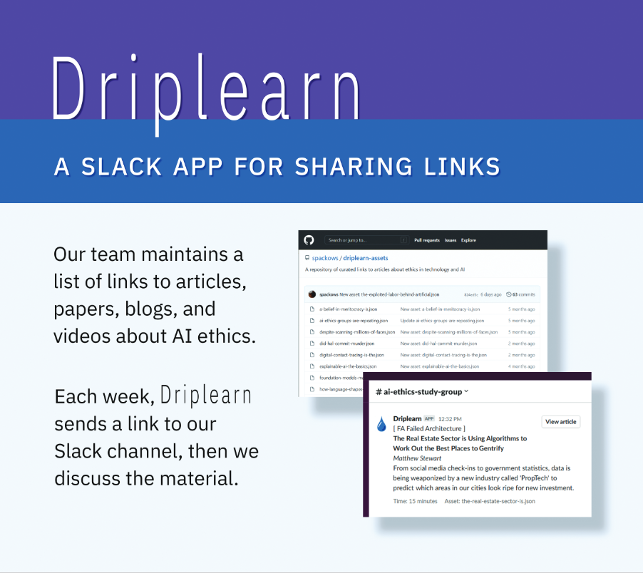
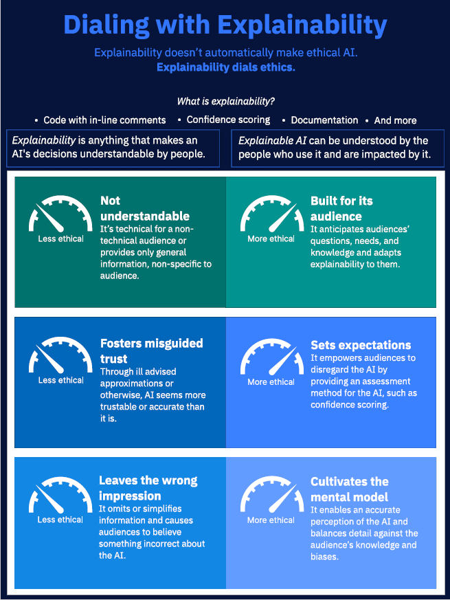
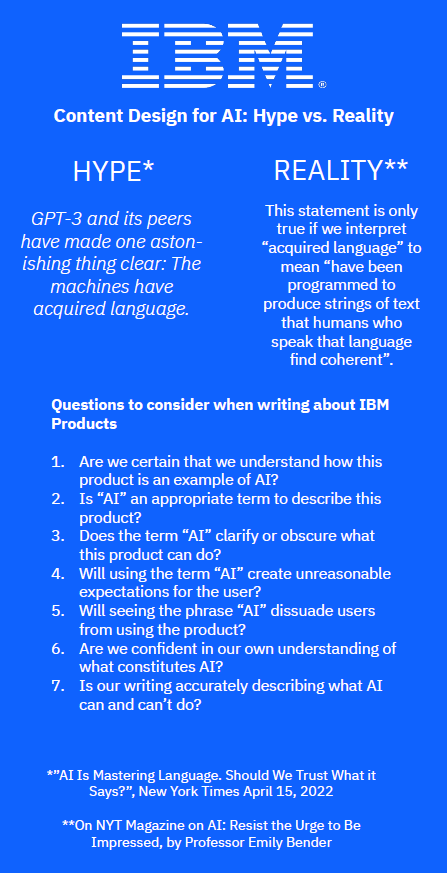
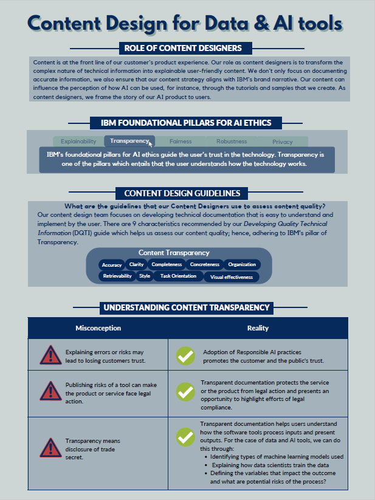
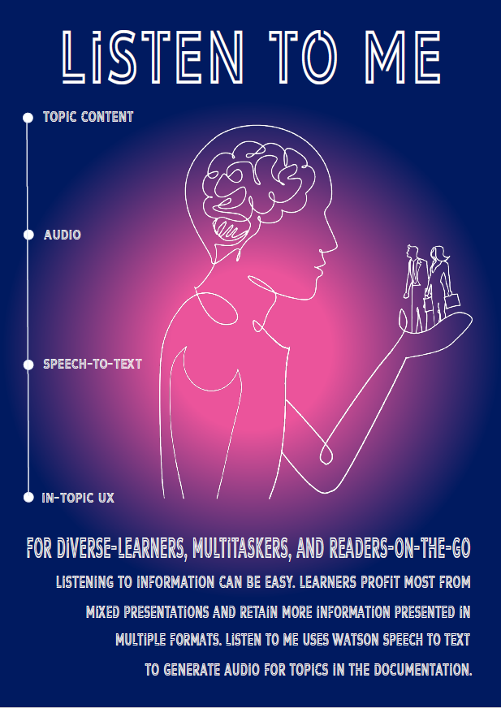
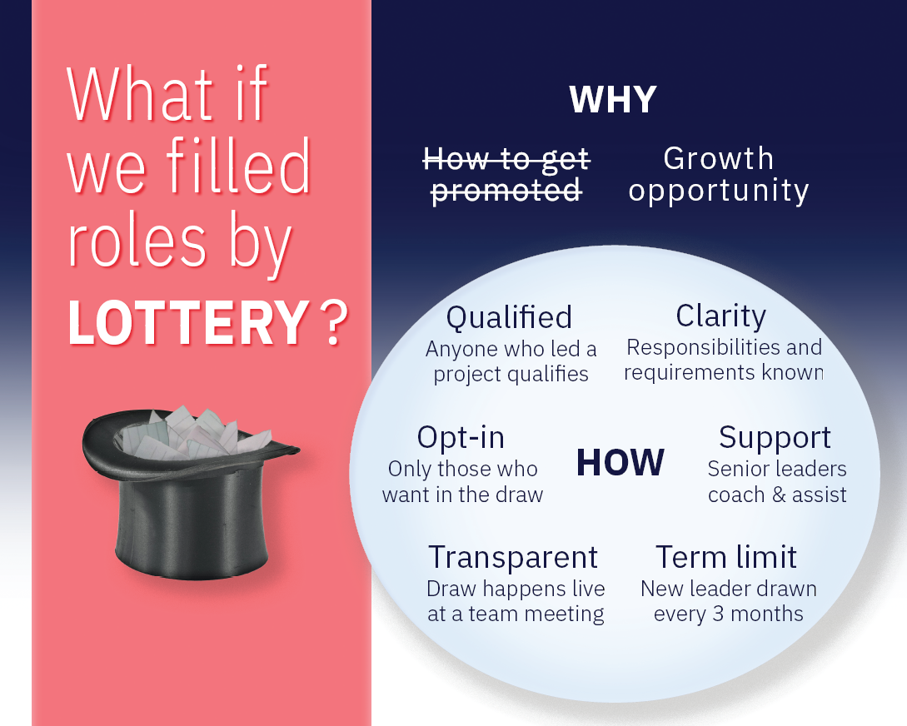

# WEAVESPHERE 2022 Expo
**AI Ethics: The Content Design Perspective**

Sarah Packowski - IBM - ( spackows@ca.ibm.com ) 
Heather Hagerty - IBM - ( hhagerty@us.ibm.com ) 
Sara Elsharawy - IBM - ( saraelsh@ibm.com ) 
James Walsh - IBM - ( James.Walsh18@ibm.com ) 
Ashley Zhao - IBM - ( Ashley.Zhao@ibm.com ) 
Kelly Xiang - IBM - ( Kelly.Xiang@ibm.com ) 
Claudia Elbourn - IBM - ( crelbour@us.ibm.com )

&nbsp;

## Summary

You might assume that considering issues of AI ethics is the responsibility of only AI researchers, people who build and train AI models, and programmers who develop AI applications. But ethics has always been a core aspect of Content Design. 

As Content Designers, we focus on: story telling, explaining, clarifying, and teaching. We write product documentation and error messages, we create samples and tutorials, and we craft the words you see in graphical user interfaces. To be effective, we must perform user research to understand mental models people use to navigate technology like AI. 

We consider issues of ethics, justice, and fairness whenever we simplify terms of use, clarify the components of complex systems, explain the output of AI models, choose inclusive and transparent language, and highlight examples and tutorials that demonstrate ethical uses of AI. 

This exhibit demonstrates how Content Design builds trust and drives ethical outcomes.

&nbsp;

## Posters

<table>
<tr>
<th>Poster</th>
<th>Description</th>
</tr>
<!-- Driplearn -->
<tr>
<td valign="top">

<b>Driplean</b>

</td>
<td valign="top">

This poster describes Driplearn, a Slack bot for helping you learn about AI ethics. You can ask Driplearn to send you a link to an article from a list of curated articles about AI ethics.  You can also configure the bot to send article links to a given Slack channel on a schedule.

Creator: Sarah Packowski

Download: <a href="posters/driplearn.pdf">Poster</a>

</td>
</tr>
<!-- Explainability -->
<tr>
<td valign="top">

<b>Explainability</b>

</td>
<td valign="top">

Explainability doesn't automatically make ethical AI.  Explainability dials ethics.

Creator: Claudia Elbourn

Download: <a href="posters/explainability.pdf">Poster</a>

</td>
</tr>
<!-- Hype vs. Reality -->
<tr>
<td valign="top">

<b>Hype vs. Reality</b>

</td>
<td valign="top">

Using hype around GPT-3 in the media as a case study, this poster discusses important questions Content Designers ask when considering how to talk about AI.

Creator: James Walsh

Download: <a href="posters/questions.pdf">Poster</a>

</td>
</tr>
<!-- Pillars -->
<tr>
<td valign="top">

<b>Content Design for AI</b>

</td>
<td valign="top">

Our role as content designers is to transform complex, technical information into explainable, user-friendly content.  This poster describes how IBM's pillars for AI ethics, Content Design guidelines, and principles of transparency guide our work.

Creator: Sara Elsharawy

Download: <a href="posters/pillars.pdf">Poster</a>

</td>
</tr>
<!-- Listen -->
<tr>
<td valign="top">

<b>Listen to Me</b>

</td>
<td valign="top">

This poster list the benefits of making content available in audio format in addition to text.

Creator: Kelly Xiang

Download: <a href="posters/listen.pdf">Poster</a>

</td>
</tr>
<!-- Lottery -->
<tr>
<td valign="top">

<b>Choosing by lottery</b>

</td>
<td valign="top">

This poster describes key points about how we use a lottery process to choose team leaders.  Choosing people for roles by lottery is a way to avoid the inevitable bias that happens when choosing people in the traditional way.

Creator: Sarah Packowski

Download: <a href="posters/lottery.pdf">Poster</a>

</td>
</tr>
</table>

